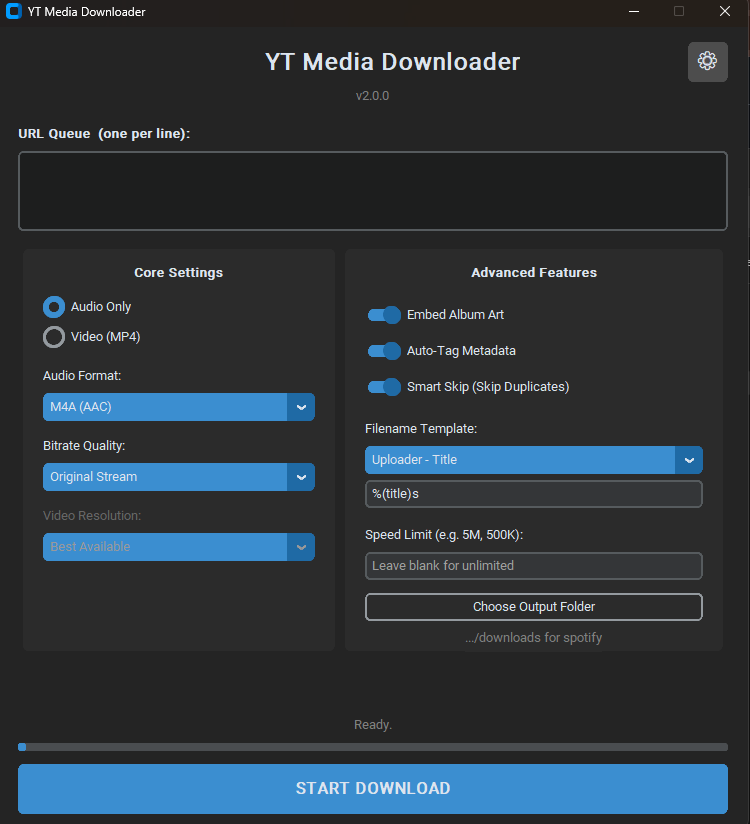
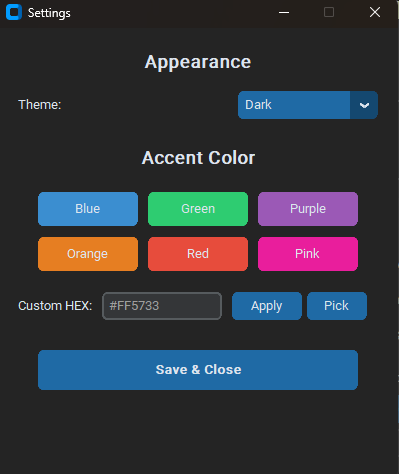

# YT Media Downloader 🚀

A modern, fully-featured desktop application for downloading high-quality audio and video from YouTube. Built with a sleek customizable UI, multi-threading for flawless performance, and an open-source backbone that guarantees zero ads, zero trackers, and zero sketchy web conversions.

> **Project Status**: This project is considered **feature-complete** as of v2.0. It is stable and fully functional. While active development has concluded, community contributions and feature requests are welcome — feel free to [open an Issue](https://github.com/YTMediaDownloader/YTMediaDownloader/issues) on GitHub.

## 📸 Screenshots

  
  

## ✨ Features

### Core Engine
- **Pristine Audio Quality**: Directly extracts YouTube's native high-quality audio streams (AAC/Opus) without forcing destructive MP3 compression.
- **Universal Support**: Paste a single video, a massive 500-video playlist, or a mix of both. The engine detects and handles everything automatically.
- **Lossless & Lossy Formats**: Choose between M4A, MP3, OPUS, FLAC, and WAV.
- **Video Downloads**: Full MP4 video support with a resolution selector (4K, 1440p, 1080p, 720p, 480p).

### Smart Features
- **Batch Queue System**: Paste multiple URLs at once (one per line) or **drag-and-drop** them directly from your browser. The app processes them sequentially — no babysitting required.
- **Smart Skip Database**: The app remembers every video you've downloaded. Re-run a playlist and it instantly skips existing tracks, only grabbing the new ones.
- **Auto-Metadata Tagging**: Automatically parses YouTube titles (e.g., `Artist - Song`) and embeds Artist/Title into ID3 metadata for seamless library integration.
- **Album Art Embedding**: Grabs the high-resolution video thumbnail, converts it to JPEG, and permanently embeds it as the track's cover art.
- **Custom Filename Templates**: Choose from presets (`Title`, `Uploader - Title`, `Numbered`) or define your own naming pattern using yt-dlp tags.

### User Experience
- **Live Progress Stats**: Real-time download speed, ETA, and playlist progress counter displayed in the status bar.
- **In-App Update Notifications**: Automatically checks GitHub for new releases on startup and notifies you with one click to the download page.
- **Personalization Suite**: Full Settings window with Dark/Light/System theme toggle, 6 accent color presets, custom HEX input, and a native color picker.
- **Persistent Settings**: All preferences (theme, colors, toggles, output folder) are saved to `config.json` and restored automatically on startup.
- **Speed Limiter**: Built-in throttle control so you can download in the background without affecting your network.
- **Background Auto-Retry**: Built-in network resilience with automatic retries on dropped fragments.

## 🛠️ Tech Stack

| Technology | Purpose |
|---|---|
| **customtkinter** | Modern Windows 11-style dark/light mode GUI |
| **yt-dlp** | Gold-standard backend engine for media extraction |
| **FFmpeg** | Audio/video conversion and thumbnail processing |
| **mutagen** | Safe metadata and album art injection |
| **PyInstaller** | Compiles everything into a single portable `.exe` |

## 🎮 How to Use

1. **Launch**: Run `YT_Media_Downloader.exe`.
2. **Paste**: Drop any YouTube URL(s) into the text box — one per line for batch downloads.
3. **Configure**:
   - Pick **Audio** or **Video** mode.
   - Choose your format, bitrate, or video resolution.
   - Toggle Album Art, Metadata, and Smart Skip on/off.
   - Set a custom filename template if desired.
4. **Download**: Hit `START DOWNLOAD` and watch the live progress stats. The UI stays perfectly smooth via multi-threading.
5. **Personalize**: Click the ⚙ gear icon to change themes and accent colors.

## 📋 Version History

| Version | Highlights |
|---|---|
| **v2.0.x** | Batch Queue, Custom Naming, Settings Window, Theme Engine, Accent Colors |
| **v1.3.0** | Smart Skip Database, Video Resolution Selector |
| **v1.2.0** | In-App Update Notifications |
| **v1.1.0** | Live Progress Stats (Speed/ETA), M4A Thumbnail Fix |
| **v1.0.1** | Per-video playlist thumbnail fix |
| **v1.0.0** | Initial release |

---

## ⚖️ Disclaimer
This tool is intended for downloading your own uploads, content you have permission to download, public-domain media, or properly licensed content. Users are responsible for complying with YouTube's Terms of Service and copyright law.

_Built transparently, locally, and safely._
